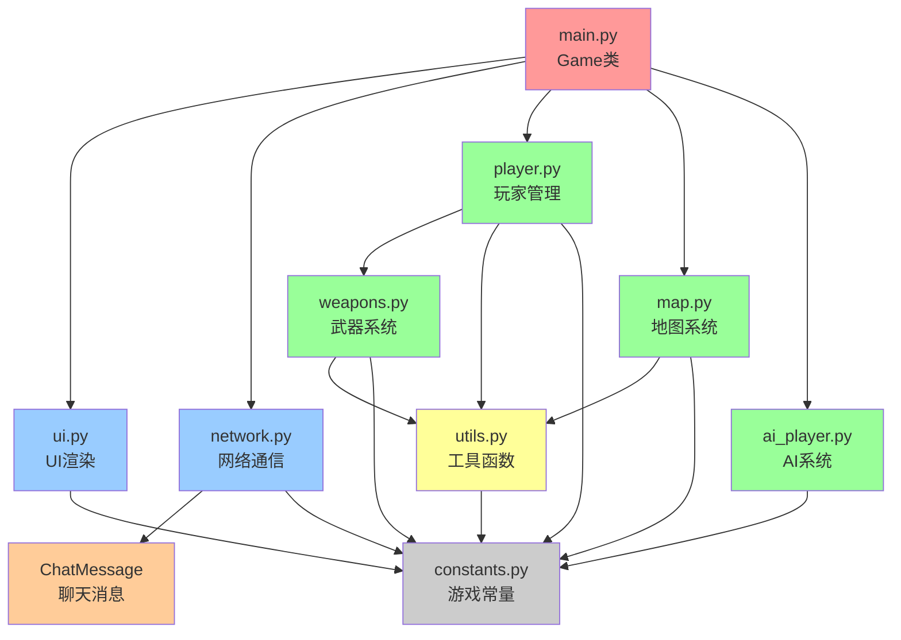

# 模块依赖关系图

## 概述

本文档描述了重构后项目的模块依赖关系和各模块的职责。

## 模块架构图



## 模块分层

### 第0层：配置层
- **constants.py**: 游戏常量和配置参数
  - 不依赖任何其他模块
  - 被所有模块导入

### 第1层：工具层
- **utils.py**: 通用工具函数
  - 仅依赖 constants.py
  - 提供纯函数，无副作用
  - 被多个模块使用

### 第2层：基础功能层
- **ui.py**: UI渲染函数
  - 依赖: constants.py
  - 职责: 字体管理、界面绘制
  
- **network.py**: 网络通信
  - 依赖: constants.py
  - 职责: 网络管理、聊天消息

- **weapons.py**: 武器系统
  - 依赖: constants.py, utils.py
  - 职责: 武器类定义和行为

### 第3层：游戏实体层
- **player.py**: 玩家管理
  - 依赖: constants.py, utils.py, weapons.py
  - 职责: 玩家状态、移动、射击、受伤等

- **map.py**: 地图系统
  - 依赖: constants.py, utils.py
  - 职责: 地图生成、房间管理、门交互

- **ai_player.py**: AI系统
  - 依赖: constants.py, player.py, weapons.py, utils.py
  - 职责: AI行为、路径规划、决策

### 第4层：游戏控制层
- **main.py**: 游戏主循环
  - 依赖: 所有其他模块
  - 职责: 游戏状态管理、主循环控制

## 模块职责详解

### main.py - 游戏主循环
**职责**:
- 游戏初始化和主循环
- 游戏状态管理（菜单、游戏中、暂停等）
- 事件处理和输入管理
- 协调各模块工作

**主要类**:
- `Game`: 游戏主类

**主要函数**:
- `generate_default_player_name()`: 生成默认玩家名
- `get_local_ip()`: 获取本机IP
- `get_network_range()`: 获取网络范围
- `scan_for_servers()`: 扫描服务器

**不包含**:
- 具体的游戏逻辑实现（已移至其他模块）
- UI绘制代码（已移至ui.py）
- 工具函数（已移至utils.py）

---

### player.py - 玩家管理
**职责**:
- 玩家状态管理（位置、速度、角度、生命值等）
- 玩家移动和物理
- 武器管理和切换
- 受伤和复活逻辑
- 玩家渲染

**主要类**:
- `Player`: 完整的玩家类

**主要方法**:
- `update(dt)`: 更新玩家状态
- `take_damage(damage, custom_respawn_time)`: 受伤处理
- `respawn(x, y)`: 复活玩家
- `switch_weapon()`: 切换武器
- `start_melee_attack(is_heavy)`: 开始近战攻击
- `check_melee_hit(targets, obstacles)`: 检查近战命中
- `draw(screen, screen_offset, debug_mode)`: 绘制玩家

---

### map.py - 地图系统
**职责**:
- 地图生成（九宫格房间系统）
- 墙壁和房间管理
- 门的创建和管理
- 随机出生点生成
- 地图渲染

**主要类**:
- `Map`: 地图类
- `Door`: 门类

**Map类主要方法**:
- `initialize_map()`: 初始化九宫格地图
- `get_random_spawn_pos()`: 获取随机出生点
- `update(dt)`: 更新地图状态
- `draw(screen, screen_offset, in_fog)`: 绘制地图

**Door类主要方法**:
- `update(dt)`: 更新门状态和动画
- `try_interact(player_pos)`: 尝试交互
- `open() / close()`: 开关门
- `check_collision(rect)`: 碰撞检测
- `draw(screen, screen_offset, in_fog)`: 绘制门

---

### weapons.py - 武器系统
**职责**:
- 武器类定义
- 武器行为实现
- 子弹和射线管理

**主要类**:
- `MeleeWeapon`: 近战武器类
- `Bullet`: 子弹类
- `Ray`: 射线类（即时命中检测）

**MeleeWeapon主要方法**:
- `start_attack(is_heavy)`: 开始攻击
- `update(dt)`: 更新武器状态
- `is_attacking()`: 是否正在攻击
- `can_deal_damage()`: 是否可以造成伤害

**Bullet主要方法**:
- `update(dt)`: 更新子弹位置
- `draw(screen, screen_offset)`: 绘制子弹

**Ray主要方法**:
- `cast_ray()`: 执行射线检测
- `get_hit_player()`: 获取被击中的玩家
- `is_expired()`: 检查轨迹是否过期
- `draw(surface, camera_offset, ...)`: 绘制射线轨迹

---

### network.py - 网络通信
**职责**:
- 服务器创建和管理
- 客户端连接管理
- 网络消息收发
- 游戏状态同步
- 聊天消息管理

**主要类**:
- `NetworkManager`: 网络管理器
- `ChatMessage`: 聊天消息类

**NetworkManager主要方法**:
- `start_server(server_name)`: 启动服务器
- `connect_to_server(ip, player_name)`: 连接服务器
- `send_data(data)`: 发送数据
- `receive_data()`: 接收数据
- `broadcast_data(data)`: 广播数据
- `add_chat_message(player_id, player_name, message)`: 添加聊天消息

**ChatMessage主要方法**:
- `get_player_color(player_id)`: 获取玩家颜色
- `is_expired(current_time)`: 检查消息是否过期

---

### ai_player.py - AI系统
**职责**:
- AI玩家行为
- 路径规划（A*算法）
- 决策系统
- 感知系统（视觉+听觉）
- AI状态管理

**主要类**:
- `AIPlayer`: AI玩家类（继承自Player）

**主要方法**:
- `update(dt, players, game_map)`: 更新AI状态
- `update_perception(players, game_map)`: 更新感知
- `update_behavior(dt, players, game_map)`: 更新行为
- `find_path_to(target_pos, game_map)`: 路径规划
- `move_along_path(dt, game_map)`: 沿路径移动

**AI行为模式**:
- Patrol（巡逻）
- Chase（追击）
- Attack（攻击）
- Retreat（撤退）

---

### ui.py - UI渲染
**职责**:
- 字体加载和管理
- 菜单界面绘制
- 游戏HUD绘制
- 聊天界面绘制
- 跨平台字体兼容

**主要函数**:
- `load_fonts()`: 加载字体
- `get_fonts()`: 获取字体字典
- `draw_menu(screen, game_state)`: 绘制主菜单
- `draw_hud(screen, player, network_manager)`: 绘制HUD
- `draw_chat(screen, chat_messages, ...)`: 绘制聊天界面

**字体管理**:
- 智能检测操作系统
- 选择最佳字体
- 验证中文渲染能力
- 提供详细日志

---

### utils.py - 工具函数
**职责**:
- 提供通用工具函数
- 角度计算
- 视野检测
- 碰撞检测
- 几何计算

**主要函数**:

#### 角度计算
- `normalize_angle(angle)`: 标准化角度到-180到180度
- `angle_difference(angle1, angle2)`: 计算两角度的最小差值

#### 视野检测
- `is_in_field_of_view(player_pos, player_angle, target_pos, fov_degrees)`: 检查目标是否在视野内
- `is_visible(player_pos, player_angle, target_pos, fov_degrees, walls, doors)`: 检查目标是否可见
- `has_line_of_sight(start_pos, end_pos, walls, doors)`: 检查两点间是否有视线
- `create_vision_fan_points(player_pos, player_angle, fov_degrees, vision_range, num_points)`: 创建视角扇形点集

#### 碰撞检测
- `line_intersects_rect(start, end, rect)`: 检查线段是否与矩形相交
- `line_intersects_line(p1, p2, p3, p4)`: 检查两线段是否相交
- `is_in_melee_range(attacker_pos, attacker_angle, target_pos, melee_range, melee_angle)`: 检查是否在近战范围

**特点**:
- 所有函数都是纯函数
- 无副作用
- 可被任何模块使用

---

### constants.py - 游戏常量
**职责**:
- 定义游戏常量
- 配置参数
- 颜色定义
- 网络配置

**主要常量**:
- 屏幕设置: `SCREEN_WIDTH`, `SCREEN_HEIGHT`
- 玩家设置: `PLAYER_SPEED`, `PLAYER_RADIUS`, `PLAYER_HEALTH`
- 武器设置: `BULLET_SPEED`, `MAGAZINE_SIZE`, `RELOAD_TIME`
- 视野设置: `VISION_RANGE`, `NORMAL_FOV`, `AIMING_FOV`
- 网络设置: `SERVER_PORT`, `BUFFER_SIZE`

---

## 依赖规则

### 避免循环依赖
1. **分层设计**: 低层模块不依赖高层模块
2. **utils.py作为基础**: 只依赖constants.py，不导入其他模块
3. **main.py作为顶层**: 可以导入所有模块，但不被其他模块导入

### 导入原则
1. **明确导入**: 使用`from module import Class`而不是`import module`
2. **避免`import *`**: 除了constants.py和utils.py
3. **按需导入**: 只导入需要的类和函数

### 模块独立性
1. **utils.py**: 完全独立，可单独测试
2. **ui.py**: 不依赖游戏逻辑，只负责渲染
3. **network.py**: 网络逻辑独立，不依赖游戏实体
4. **weapons.py**: 武器逻辑独立，可单独测试

---

## 重构前后对比

### 重构前
```
main.py (5000+ 行)
├── Game类
├── Player类
├── Map类
├── Door类
├── Bullet类
├── Ray类
├── ChatMessage类
├── 所有工具函数
├── 所有UI函数
└── 网络函数
```

### 重构后
```
main.py (精简后)
├── Game类
└── 辅助函数

player.py
└── Player类（完整）

map.py
├── Map类（完整）
└── Door类

weapons.py
├── MeleeWeapon类
├── Bullet类
└── Ray类

network.py
├── NetworkManager类
└── ChatMessage类

utils.py
└── 所有工具函数

ui.py
└── 所有UI函数

ai_player.py
└── AIPlayer类

constants.py
└── 所有常量
```

---

## 优势总结

### 1. 可维护性提升
- 每个模块职责清晰
- 代码易于定位和修改
- 减少了代码耦合

### 2. 可测试性提升
- 模块可独立测试
- 工具函数易于单元测试
- 减少了测试复杂度

### 3. 可扩展性提升
- 添加新功能只需修改相关模块
- 不会影响其他模块
- 便于团队协作

### 4. 代码复用
- 工具函数可在多处使用
- UI函数可被不同界面调用
- 减少了代码重复

### 5. 性能优化
- 模块化后更容易识别性能瓶颈
- 可针对性优化特定模块
- 不影响其他功能

---

## 未来改进方向

### 1. 进一步模块化
- 考虑将Game类拆分为GameStateManager和GameLoop
- 将网络同步逻辑独立出来

### 2. 添加单元测试
- 为utils.py添加完整的单元测试
- 为weapons.py添加测试
- 为player.py添加测试

### 3. 配置文件化
- 将constants.py改为JSON/YAML配置文件
- 支持运行时配置修改

### 4. 插件系统
- 设计插件接口
- 支持自定义武器
- 支持自定义地图

### 5. 性能监控
- 添加性能分析工具
- 监控各模块性能
- 优化瓶颈模块
